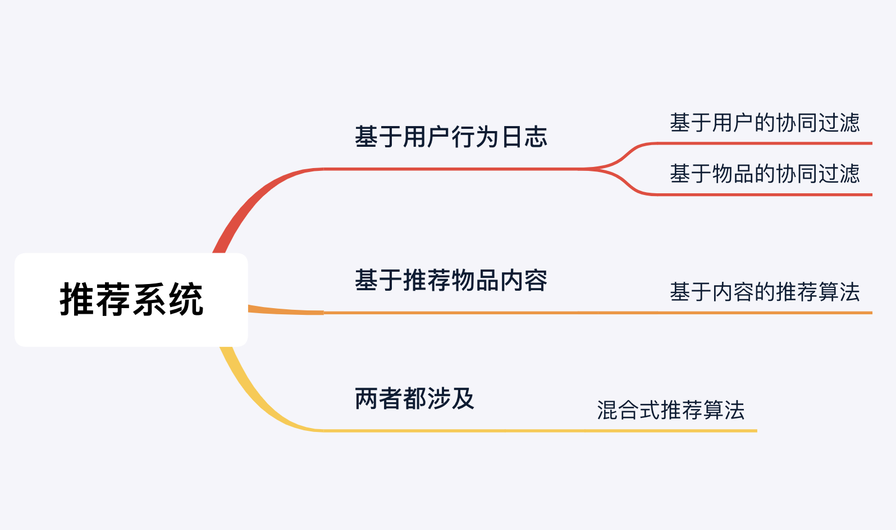
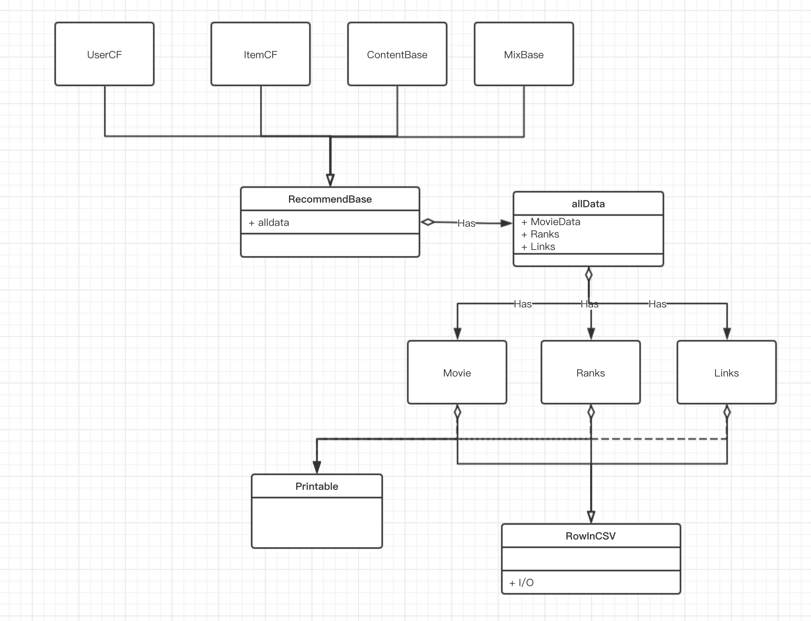

**正逐步部署于Spring + SpringMVC实现推荐效果可视化**


# 推荐系统

[TOC]

# 一. 概述

推荐系统的两个终极目的 

* 推荐用户可能喜欢的物品
* 帮助用户发掘自己喜欢的物品


# 二. 推荐算法分类


根据 **数据(分析日志)** 的来源不同, 我们可以把推荐算法分为如下几个类别: 

- [协同过滤](协同过滤.md)
- [基于内容的推荐](基于内容的推荐.md)
- [混合式推荐](混合式推荐算法.md)





# 三. 推荐系统中相似度的评判标准

推荐系统中, 对于 **两个向量 (不管向量代表的什么, e.g. 物品的内容向量, 用户的看过电影向量, 等等)** 的相似度一般有如下的评判标准 : 

- 🌟Consine(余弦) 相似度 

  从而Sim(x, y)  = $\frac{x \cap y}{\sqrt{|x||y|}}$ 

  **余弦相似度就是: 两个向量重合的元素除以这个两个向量的长度**


- 欧式距离

  这种就是计算两个向量x, y之间的几何距离:

  d(x, y) = $\sqrt{\sum(x_i - y_i)^2}$

  由于距离越近, 我们计算的相似度需要越高, 所以我们的相似度可以表现为欧式距离的倒数:
  Sim(x, y) = $\frac{1}{1+d(x, y)}$


- 🌟 皮尔逊相关系数

  基于协方差 cov(X, Y) 我们用X, Y的协方差除以 X, Y的标准差乘积, 得到X, Y的相关系数:
  Sim(x, y) = $\frac{cov(x, y)}{\sqrt{Var[x] * Var[y]}}$ , 其中, Var[x] 为x的方差. 且 Sim(x, y) $\in$ [-1, 1] .

  这个表示的是X, Y的相关程度, 如果值为 -1 表示x, y完全负相关, 值为 +1 表示正相关, 为 0 表示基本没有关系	

  ```
  协方差 cov(x, y) 的求法演示
  cov(x, y) = E(xy) - E(x) * E(y) , 其中 E 为数学期望
  假设 x = [x1, x2, x3] , y = [y1, y2, y3]
  
  求法如下 : 
  E(x) = (x1 + x2 + x3) / 3 
  E(y) = (y1 + y2 + y3) / 3
  E(xy)= (x1*y1 + x2*y2 + x3*y3) / 3
  ```


# 四. 设计系统的 UML





