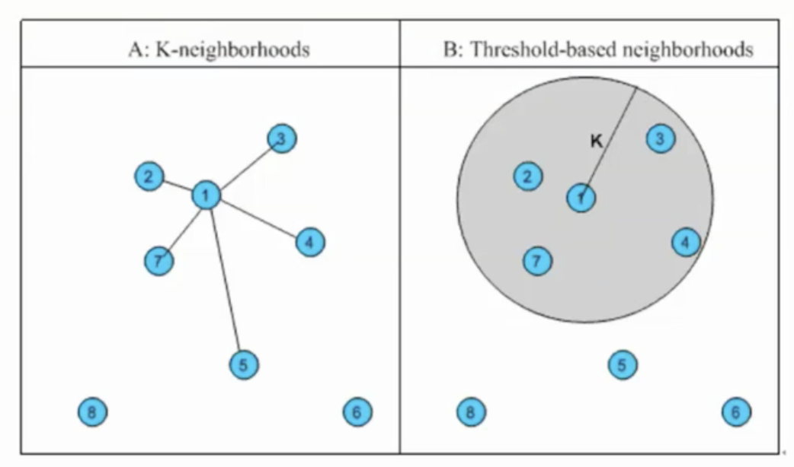

[TOC]

# 一. 协同过滤

**仅仅 基于用户行为日志设计的推荐算法**, 在算法分类上, 可以分为以下几类:

注意协同过滤不会取利用和利用任何和物品有关的信息, 而运用的都是 **集体用户的信息**

* 基于领域的协同过滤算法
* 隐语义模型
* 图的随机游走算法

## I 基于领域的协同过滤算法

主要包含下面两种算法, 也是 **工业界运用广泛的两个算法**

- Item-based : 基于物品
- User-based : 基于用户

### 基本思想

利用 和 **自己兴趣相似的用户**, 或者和 **自己历史感兴趣物品相似的物品** , 来对用户进行推荐

**总结来说, 利用别人, 推荐自己**

协同过滤可以分为以下两种 : 

基于用户的(User-based) : 

* 在众多用户中, 以某种算法找到跟我相似的用户集
* 然后以某种算法对这个用户集进行排序
* **从而相似用户集喜爱的产品, 被推荐人大概率也会喜欢**

基于物品(Item-based)的 :

* 如果我喜爱某一个物品, 那么大概率我会喜欢跟这个 **物品类似的物品**

  注意 ,此时物品的相似, 并不是内容相似, 否则就变成基于内容的了.

#### 相似物品, 用户数量的选择方案

即假设我们计算一个用户Fz和其他用户相似度之后, 怎么确定我们选择这些相似用户的数量, 即我们应该选择多少用户作为和Fz的相似用户, 有两种方案 :

* 我们选择固定数量 K 的邻居, 从而演变成 K-neighborhoods 算法
* 🌟 我们设定一个相似度门槛 Threshold, 从而选择 **所以小于** 这个门槛的邻居, 从而演变成 Threshold-based neighborhoods 算法

如下图可以显示出两者区别 :

### 基于用户的协同过滤

重温一下, 核心思想为 : 如果A,B相似, 那么B喜欢的东西, A大概率也会喜欢, 从而将B有A没有的东西推荐给A, 以下例子举例 :

| 用户 / 物品 | 物品 A | 物品 B | 物品 C | 物品 D   |
| ----------- | ------ | ------ | ------ | -------- |
| 用户A       | ✅      |        | ✅      | **推荐** |
| 用户B       |        | ✅      |        |          |
| 用户C       | ✅      |        | ✅      | ✅        |

通过相似度可以计算得知 A, C 更为相似, 从而将物品D推荐给用户A

**基于用户的协同过滤 有以下步骤**

1. 找到和 目标用户 兴趣相似的 用户集合
2. 找到这个集合中 用户喜欢的, 但是 目标用户没有的 推荐给 目标用户

#### 相似用户的评判标准

相似用户有多种评判标准 : 

1. 🌟余弦相关性计算, 直接利用两个用户 **兴趣交集** 计算

    $ \frac{ {UserA \cap UserB}}{\sqrt{|UserA| |UserB|}} $ : 即 A, B 相同爱好的数目 为分子 , A 的爱好的数目 * B 的爱哈的数目 去根号为分母.

#### 公式 

**用户 u 对 物品 i**  的感兴趣程度为 $p(u, i) = \sum _{v \in S(u, K) \cap N(i)} W_{u, v} * R_v $

* p(u, i) 表示用户 u 对 i 的 感兴趣程度
* S(u, K) 表示 和 用户 u 最相似的 K 个用户
* N(i) 表示对 物品 i 有评价的用户
* $W_{u, v}$ 表示 用户u, v 的相似度
* R$_v$  (Ranking) 表示用户 v 对 物品的评分 

#### 基于用户的协同过滤UserCF存在的问题

* 对于一个新的用户, 我们很难去给他做推荐. 因为一个新用户的用户画像矩阵全为0, 没有任何特征, 也就找不出他的相似用户, **这称为用户冷启动问题**

* 对于一个物品推荐与否, 完全取决于相似用户喜欢与否, 太过于绝对

* 对于海量用户的系统, 用户群体过于庞大, 计算相似度的效率非常低下 (两两计算的).

* 人是善变的, 从而我们需要去实时的维护这个庞大的稀疏矩阵, 不太现实

* 用户的打分 **矩阵非常稀疏**, 因为一个用户可能就关注过 100 个物品, 但是物品的总数有 100万个, 从而使得这个矩阵非常稀疏!

#### 对于基于用户协同过滤 常考虑的优化方法

* 考虑乘以一个系数 CommonRate = min(n, N) / N

  即 A, B用户间共同打分的物品数目除以物品总数. 因为A,B如果共同打分的物品越多, A,B肯定越为相似

* 对物品打分进行 **归一化处理** , 全部归一化到 [0, 1] 的范围内

### 基于物品的协同过滤🌟 

**是目前工业界使用最多的算法**

重温基本思想 : 如果 **物品 A, B相似** , 那么如果 用户User喜欢 A, 就可以将 B 也推荐给User.

e.g.

| 用户 / 物品 | 物品 A | 物品 B | 物品 C |
| ----------- | ------ | ------ | ------ |
| 用户A       | ✅      |        | ✅      |
| 用户B       | ✅      | ✅      | ✅      |
| 用户C       | ✅      |        | 推荐   |

即可以算出, 物品 A 和 物品 C 的相似度更高, 从而可以将物品C推荐给用户C

注意, 物品的相似度还是基于大众评分, 并不是基于物品的 内在属性. 

比如 **啤酒** 和 **纸尿裤**, 相似度就可能很高

#### ItemCF 的主要步骤

1. 计算出 **物品** 时间的相似度
2. 根据物品的相似度, 以及用户的浏览历史, 给用户做出推荐

#### 物品相似度的定义

同样物品相似度的定义有许多方法,如下 :

**第一种定义方法**

核心思想为, 购买了该商品的用户也经常购买其他商品, 根据此我们可以定义出 **物品i, j之间的相似度为** W$_{i, j}$ = $\frac{|N(i) \cap N(j)|}{N(i)}$ 

其中 N(i) 为喜欢物品 i  的用户的总数, 所以公式可以解释为 : **喜欢 物品 i 的用户中  也喜欢 物品 j 的用户的比例**

**这种方法有一个问题 :**

就是如果 物品 j 是一个热门的物品, 那么会导致 物品 j 和所有的物品相似度都很大

**🌟 第二张定义方法**

针对第一种方法的问题, 我们提出第二种方法 (在分母中除以 N(j) 达到惩罚 物品J 的目的): $\frac{|N(i) \cap N(j)|}{\sqrt{|N(j)N(i)|}}$  

可以看到 ItemCF 和 UserCF 定义 用户, 或者物品相似度的公式非常相似.

**第三种定义方法**

在第二种的惩罚的基础上,  继续对物品 j 进行惩罚, 因为第二种对于有 热门物品 j 还是效果不太显著, 我们可以在分母上加上 $\alpha$ 继续加大惩罚力度 :   $\frac{|N(i) \cap N(j)|}{|N(j)|^{\alpha} |N(i)|^{1- \alpha}}$   其中 j 为热门物品, 当 $\alpha$ 等于 0.5 的时候, 就是原始的 相似度计算方式

#### 公式

对于一个 用户没有使用过的物品 j (没看过的电影) , 用户 u 对其的兴趣度可以描述为 :

$p_{u, j} = \sum _{i \in N(u) \cap S(j, K) }W_{i, j}R_{u, i}$

各个变量解释如下: 

* N(u) 表示 : 用户 p **曾经** 感兴趣的物品 (对于电影来说, 看过的就算, 而不管评分)

* S(j, K) 表示 : 所有物品(电影)中, 和 物品(电影) j 最为相似的 K 个电影

* i 属于 以上两个集合的 **交集** , 说明 i 既要是用户曾经感兴趣的电影, 又要是 j 类似的电影, 注意这里的取交集, 就是说有空集合的可能, 如果最后为空集合, 那么很明显 ,用户 u 感兴趣的电影里面没有一个和 电影 j 类型的 ,也就是说, 用户 u 对 j 没有兴趣. 
* $W_{i, j}$ 描述的是 物品(电影)  i, j 的相似度
* $R_{i, u}$ 描述的是 用户 u 对物品(电影) i 的评分 (如果是 0-1 评分制度, 则直接就是 1)

### UserCF  和 ItemCF  的综合比较

#### 推荐结果而言

UserCF 的推荐结果着重反映用户兴趣相似的小群体的热点

ItemCF 的推荐结果着重维系用户的历史兴趣, 更注重 **个性化**

#### 各自的适合领域

UserCF 适用于 **新闻推荐** , 因为新闻推荐 注重实效性, 且对用户个性化要求较低, 且新闻跟新频繁不利于 Item-table 的维系

ItemCf 适用于 **图书, 电子商务, 电影网站** 等

#### UserCF 和 ItemCf 对于相似度判断的区别

UserCF 用户相似度 : $ \frac{ {UserA \cap UserB}}{\sqrt{|UserA| |UserB|}} $ 

ItemCF 物品相似度 :  $\frac{|N(i) \cap N(j)|}{\sqrt{|N(j)N(i)|}}$  

不同的是 : 

用户相似度的计算是基于 用户 A, B 之间物品的重叠

物品相似度的计算时基于 物品 i, j 之间用户的重叠

#### 基于物品的协同过滤的优势 (相比UserCF)

**效率方面**

- **计算效率高**, 通常用户的数量远大于物品的数量
- 物品属性并不经常变化, 可以不用实时的维护属性矩阵

## II 隐语义模型

​	

