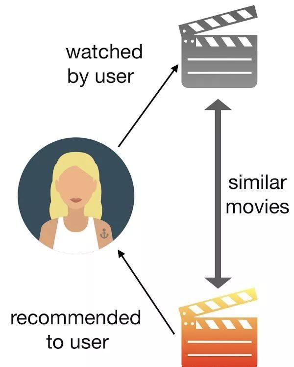

基于内容的推荐

[TOC]

## 1. 概述

基于内容的过滤的核心是得到物品的描述, 例如 一本书的 **作者, 书名, 等等**

此种方式是完全依赖于物品本身内容 (此点就有区别于 ItemCF), **ItemCF是基于其他用户** 来计算物品之间的关联性, 而基于内容的是 **根据物品本身的信息** 去计算物品之间的关联, 也就是说, 基于内容的算法不需要进行庞大的 用户群体评分计算, **即使只有一个用户, 也可以计算推荐列表**

## 2. 物品相似度评判

如何表示一个物品 Item, 一般来说, 我们通过 **关键字向量** (可以是人工贴的标签 或者 算法自动分析)来表示 :

假设物品 ItemA, ItemB 的关键字向量为 : keyWords(A),  keyWords(B). 那么 A,B 的相似度(Dice系数) 可以被写为 :

Sim(A, B) = $\frac{2 * |keyWords(A) \cap keyWords(B)|\ }{|keyWords(A)| + |keyWords(B)|}$

## 3. 获得关键词向量

关键词向量 是表示一个物品的关键, 且对于不同的关键词, 我们可以把有不同的权重, 对于物品 Item 可以别表示为:

Item = {$(e_1, w_1), (e_2, w_2), ... , (e_i, w_i)$} , 其中 w 为不同关键词对于的权重

对于不同的物品我们有不同获得关键词的方法 :

### 3.1对于文档

1. 首先通过 NLP 算法自动获得 文档的关键词($e_1, e_2, ... , e_i$) 如何 **自动** 的从一个 **电子文档** 中分析出该文档的关键字向量

2. 然后 通过著名的 **TF - IDF**  **词频** 和 **反文档频率** 分许出文档中 每一个关键词的权重, 公式如下 :

   $W_i = TF-IDF(i, j) = TF(i, j) * IDF(i, j)$   其中 i 代表关键词 $e_i$  , j 代表文档集种的一篇文档, 公式为两个子公式的乘积

   * $TF(i, j) = \frac{freq(i, j)}{maxOthers(i, j)}$   其中 freq(i, j) 为 $e_i$在j 中 出现的次数, maxOthers(i, j) 为j 中词频最高的关键词的词频 
   * $IDF(i, j)  =  log(\frac{N}{n(i)}) $  其中 N 为所有文档的总数, n(i) 为 所有文档中, 出现了关键词 i 的数量

### 3.2对于电影

对于电影我们分析的情况稍微简单, 关键词可以是电影的 **类型, 演员名,导演名, 发布时间, ... ** 然后调整相应的权重, 我们一般设为1即可.

## 4. 实现思路

对于基于内容的电影的推荐

1. 我们可以利用数据集中, 每个电影的 描述信息, e.g. `Action|Comedy|Crime|Drama|Thriller` ,作为我们的表示整个电影的向量
2. 获取一个用户的 **历史观影记录** , 然后选出评分最高的一部或者几部
3. 根据这些 **评分高的电影** 去找到和它们内容最相似的电影, 将其推荐给用户

