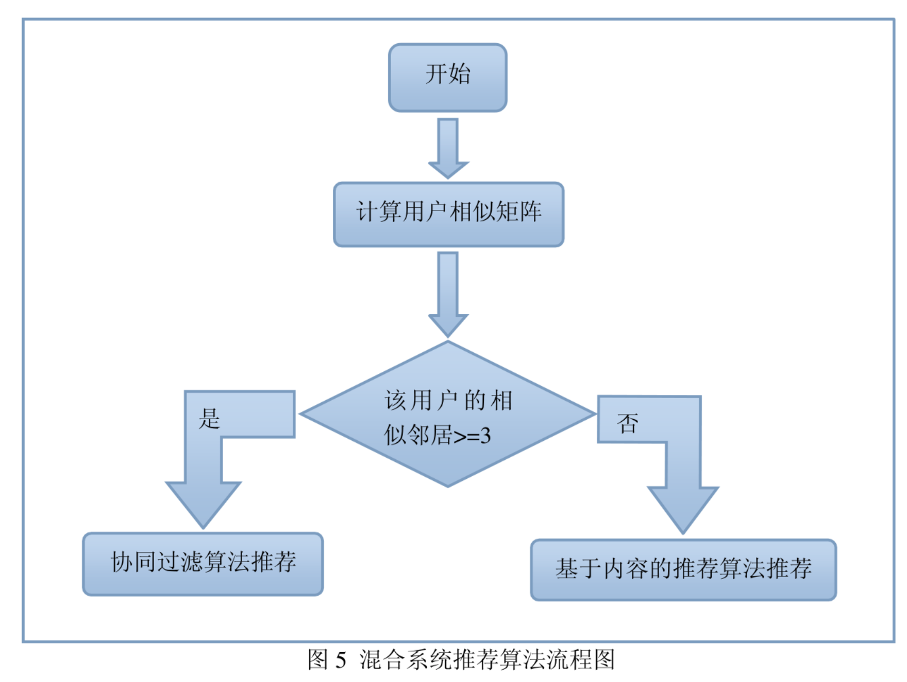

# 混合式推荐算法

[TOC]

# 一. 概述

`协同过滤` 通过计算用户之间的相似性获得推荐, 但是忽略 物品的自身的特性, 且还存在冷启动的文图

`基于内容的推荐 ` 虽然可以解决协同过滤的不足, 但是技术上会收到信息获取技术的约束

所以我们需要结合两者 获得更好的推荐效果, 从而形成了我们的 `混合过滤推荐`

混合设计分为

* 整体式 : 整体式是将几种推荐策略整合到一个算法中实现的混合设计
* 并行式 : 并行混合的推荐系统相互之间独立运行，分别产生推荐列表，随后，输出数据被组合到最终的推荐集合中
* 流水线式 : 流水线混合设计是将多个推荐系统按照流水线架构连接起来，前一个推荐系统的输出变成后一个推荐系统的输入部分

# 二. 电影推荐设计

